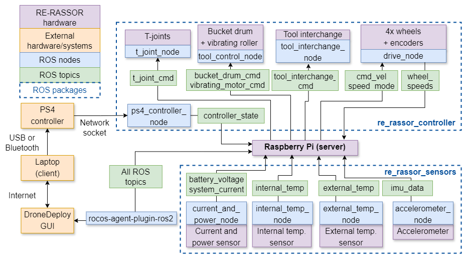
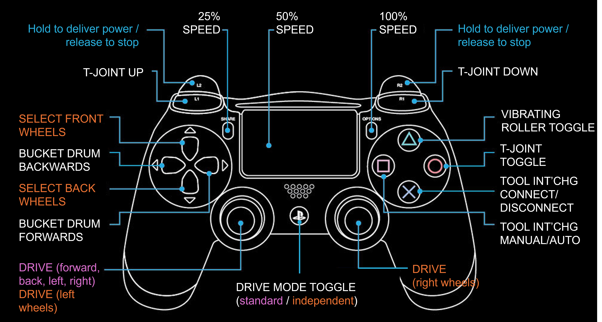

#  UoA RE-RASSOR 2024
This repositry contains the source code for the University of Adelaide's 2024 iteration of the Research & Education - Regolith Advanced Surface Systems Operations Robot (RE-RASSOR) project. The RE-RASSOR is a small-scale version of a lunar rover, that uses a variety of interchanging tools for excavation and construction.

## Table of Contents
1. [Introduction](#introduction)
2. [Architecture](#architecture)
3. [System Requirements](#system-requirements)
4. [Raspberry Pi Configuration](#raspberry-pi-configuration)
5. [Installation & Usage](#installation-&-usage)
    - [Dependencies](#dependencies)
    - [Building the Project](#building-the-project)
    - [Setting Up Services](#setting-up-services)
6. [User Guide](#user-guide)
    - [Prerequisites](#prerequisites)
    - [Startup & Operating Procedure](#startup-&-operating-procedure)
    - [Troubleshooting Tips](#troubleshooting-tips)
7. [Recommended Future Work](#recommended-future-work)
11. [Authors & Acknowledgement](#authors-&-acknowledgement)

## Introduction
Established by the Florida Space Institute, the RE-RASSOR program involves international collaboration between universities, aiming to constantly bring new research and improvements to the platform. This project builds upon the work of the University of Adelaide’s 2022 and 2023 teams, and aims to improve the rover's design, functionality and performance. The 2024 project saw significant changes implemented to the actuator control systems of the rover, and hence significant changes to the software. The aims of the software component of the project were to develop enhanced software systems for user control and feedback, through developing a modular system with a physical control interface and a graphical user interface, with integrated sensor feedback. The software uses [ROS](https://www.ros.org/), a set of libraries and tools for building modular robot applications. The code is designed to be used in conjunction with the graphical user interace, which can be found [here](https://automate.dronedeploy.com/project/re-rassor-426007/robots/re-rassor/dashboard/247aca40-efda-11ee-a929-eb3f2ba3f8ad). Contact Teresa Kelly or the project supervisor for the login details.

## Architecture
The software architecture is shown in the diagram below. The codebase is made up of two ROS packages: one for the control nodes, and one for the sensor nodes. The control inputs are sent via a PS4 controller connected to the client laptop, over a socket connection with the Raspberry Pi. The controller state is sent to the various nodes for controlling the RE-RASSOR, while feedback is published from the sensors to the GUI.




## System Requirements
- **Hardware:** Raspberry Pi 5, with the required hardware and battery attached and configuration mentioned below, PS4 controller, external laptop client.
- **Software:** Ubuntu 24.04, ROS 2 Jazzy Jalisco, Python 3.12 (on Raspberry Pi and external laptop), [requirements.txt](https://github.com/2-tunaroll/UoA_RE_RASSOR_2024/blob/main/requirements.txt).

## Raspberry Pi Configuration
The following configuration of the Raspbery Pi 5 is required for the software to run and connect to the DroneDeploy user interface. Note that while all of these items must be completed, they don't need to be implemented in the listed order.
1. Install Ubuntu 24.04: https://ubuntu.com/download/raspberry-pi
2. Install ROS 2 Jazzy Jalisco: https://docs.ros.org/en/jazzy/Installation.html
If this is the first time using ROS, it is recommended to take some time to read through the documentation and complete some basic tutorials. It is especially important to understand how to use the build tool, `colcon`. The official ROS 2 Jazzy tutorials are here: https://docs.ros.org/en/jazzy/Tutorials.html
3. Ensure that the installed package versions are compliant with the dependency requirements for Jazzy Jalisco (especially note `numpy==1.26.4`: https://www.ros.org/reps/rep-2000.html#jazzy-jalisco-may-2024-may-2029
4. Edit the EEPROM configuration: `sudo -E rpi-eeprom-config -edit`. Add the following line to enable 5A current draw from the power supply: `PSU_MAX_CURRENT = 5000`
5. Consult the following instructions to configure the Raspberry Pi serial port: https://forums.raspberrypi.com/viewtopic.php?t=36282z. https://github.com/nasa-jpl/osr-rover-code/blob/foxy-devel/setup/rpi.md/#5-setting-up-serial-communication-on-the-rpi. This involves adding the following line to `/boot/firmware/config.txt`: `dtparam=uart0`
6. Use the following instructions to change the `raspi-config` to enable 1-wire interface and I2C: https://www.raspberrypi.com/documentation/computers/configuration.html
7. Ensure that the connected I2C devices are detected on the system by reviewing the output from `i2cdetect -y 1`. It should match this:


Note that the item at address 70 is to be ignored; it is the "all call" address for the controller chips on the Adafruit HATs.

8. Create a ROS 2 workspace named `ros2_ws` and clone the `src` directory of the RE-RASSOR repository into it: The root directory of the workspace is where the packages will be built from.
9. Install the repository’s dependencies: https://github.com/2-tunaroll/UoA_RE_RASSOR_2024/blob/main/requirements.txt
10. Add the following lines to `~/.bashrc`. This enables sourcing of the ROS 2 installation and newly built packages any time a new terminal is opened, or by running `source \~/.bashrc`. Note: Change the file paths if they are different to what is specified here.

``` bash
    source /opt/ros/jazzy/setup.bash
    source ~/ros2_ws/install/setup.bash
    export LD_LIBRARY_PATH=$LD_LIBRARY_PATH:/opt/ros/jazzy/lib
    export RMW_IMPLEMENTATION=rmw_cyclonedds_cpp
```
11. Install the rocos-agent for DroneDeploy and enable it as a service using the following instructions: https://docs-automate.dronedeploy.com/robotics-toolkit/getting-started/connect-your-own-robot/ubuntu. Note: Create an unstable build if the plugin for ROS 2 Jazzy is not yet available.
12. Install the ROS2 plugin for DroneDeploy: https://docs-automate.dronedeploy.com/robotics-toolkit/agent-plugins/ros2}. Contact DroneDeploy to retrieve a custom build for ROS 2 Jazzy if not yet available.
13. Install GStreamer to enable camera streaming to DroneDeploy: https://gstreamer.freedesktop.org/download/#linux

## Building the Project
### Dependencies


### Building the Project

### Setting Up Services
Once it is verified that all nodes run as expected, systemd service files can be enabled to run the launch files on startup. These files are located in [systemd_files](https://github.com/2-tunaroll/UoA_RE_RASSOR_2024/blob/main), and need to be placed in `/etc/systemd/system` on the Raspberry Pi. Then enable the services: `sudo systemctl enable re-rassor-sensors.service`; `sudo systemctl enable re-rassor-controller.service`.


## User Guide
### Prerequisites
1. Hardware and software configured RE-RASSOR with sufficiently charged 14.8V LiPo battery attached.
2. Access to the project's DroneDeploy dashboard.
3. Known IP address of Raspberry Pi. If not known, can open the Shell tab in DroneDeploy and run `hostname -I` to retrieve it.
4. Laptop with connected PS4 controller, /ps4_controller_node.py script and associated dependencies downloaded. Enter the IP address of the Pi on line 12.
5. Raspberry Pi and laptop connected to the same network. The Raspberry Pi should automatically connect to UofA (if available) on startup, but will need to be manually connected to another network if required, e.g. personal hotspot. Note that the device DroneDeploy is running on does not require connection to the same network, but the device that the PS4 controller is connected to does. (But these will often be the same device).

### Startup & Operating Procedure
1. Turn on RE-RASSOR AUX switch – this just turns on the Pi and sensors.
2. Verify that sensors are working and visible along with camera feed on the DroneDeploy dashboard.
3. Turn on RE-RASSOR PWR switch – this enables power delivery to the motors. 
4.  On the laptop connected to the PS4 controller, run [re_rassor_controller_client.py](https://github.com/2-tunaroll/UoA_RE_RASSOR_2024/blob/main/client_scripts/re_rassor_controller_client.py).
5. Wait for connection to be established between the server (Pi) and client (laptop).
6. Use the PS4 controller to control the RE-RASSOR as indicated by the diagram below. Note that the nodes for the desired components must be running in order to control them. Also note the ‘dead man’s switches’ L2 and R2, which are required as a safety mechanism to be pressed to deliver commands to the wheels, T-joints and tools.

7. While operating, continuously monitor the sensors on the dashboard, especially system current and battery voltage. Switch off the main power switch immediately in the case of unexpected/dangerous behaviour. See below for troubleshooting steps.

### Troubleshooting Tips
Below are some tips that may help investigate and fix common issues with operating the RE-RASSOR. These steps require establishing an SSH connection with the Raspberry Pi. To do this, open a terminal and run `ssh re-rassor@<IP\_ADDRESS>` (find IP address from DroneDeploy shell if unknown). Alternatively, the Raspberry Pi can be connected directly to a monitor, keyboard and mouse to access the graphical user interface.

**Loss of connection to DroneDeploy:** This may require restarting the rocos agent: `sudo systemctl restart rocos-agent`. Also ensure that the robot is connected to the internet.

**ROS topics not publishing / other unexpected behaviour:**
1. The data being published over a topic can be examined by running `ros2 topic echo <topic_name>`
2. To conduct further testing and make changes to individual components of the system, the relevant systemd services need to be stopped first. To stop a service: `systemctl stop <servicename>`
3. Use the testing spreadsheet provided in the final report to test against the expected behaviour for the different parts of the system.
4. Once the system is ready to run as normal, ensure the relevant packages are rebuilt if changes are made: Run `colcon build --packages-select <package\_name>` from the root ROS workspace directory. Then restart the relevant services, and confirm they are enabled for the next time the robot starts up: `systemctl is-enabled <servicename>`

## Recommended Future Work
This implementation provides a baseline for the recommended future work of the project, with the modular architecture and use of ROS 2 enabling extensibility of the existing codebase. Next steps include implementation of autonomous driving and tooling functionality and simultaneous localization and mapping (SLAM). Integration of the system with a digital simulation tool like [Gazebo](https://gazebosim.org/home) is also recommended to help with this. Implementing a control interface through the DroneDeploy dashboard is also recommended, to allow multiple methods of user control. Consult the final report for further information.

## Authors and Acknowledgement
Author: Teresa Kelly (teresa.kelly.02@icloud.com)

Original project: Florida Space Institute RE-RASSOR - https://floridaspacegrant.org/program/re-rassor/

Project supervisors: David Harvey, Rini Akmeliawati

Special thanks: William Foster-Hall
